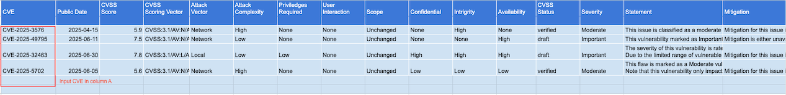
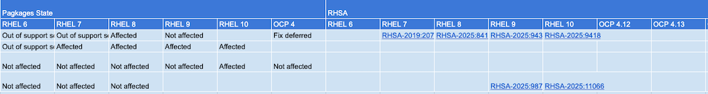

# Red Hat CVE Query Tool
## Setup
Query details of CVE with effect Red Hat Enterprise Linux and OpenShift

- Create Google sheet with column same as [example file](example/Red%20Hat%20CVEs.xlsx)
- Create App Scripts provided in directory [code](code/)
## How to use?
- Input CVE number in column A of Sheet name *Input*
  
  Remark: Method OnEdit is used for detect changes in column A then copy and paste long list of CVE

  Column B to P show CVE information

  

- Column Q onwards show details of affect product and RHSA if available.
  
  

- For batch process, create another sheet with same column layout and open app script [batch_changes](code/batch_changes.gs) and change variable sheet to your sheet name then run script

```javascript
function batch_change() {
  var sheet = SpreadsheetApp.getActiveSpreadsheet().getSheetByName("YOUR_SHEET_NAME");
  var lastRow = sheet.getLastRow(); // Get the last row with any content in the sheet
  var values = sheet.getRange("A3:A" + lastRow).getValues(); 
  Logger.log("Last row is "+lastRow);
  for (var row = 0; row < lastRow-2; row++){
      Logger.log("Process row no."+row+ " for " + values[row]); // Log the value
      if (values[row] !== undefined  ) { 
          getData(sheet,row+3,values[row]);
      }else{
         Logger.log("Row "+row+" is undefined or blank");
      }
  }
}
```
  
